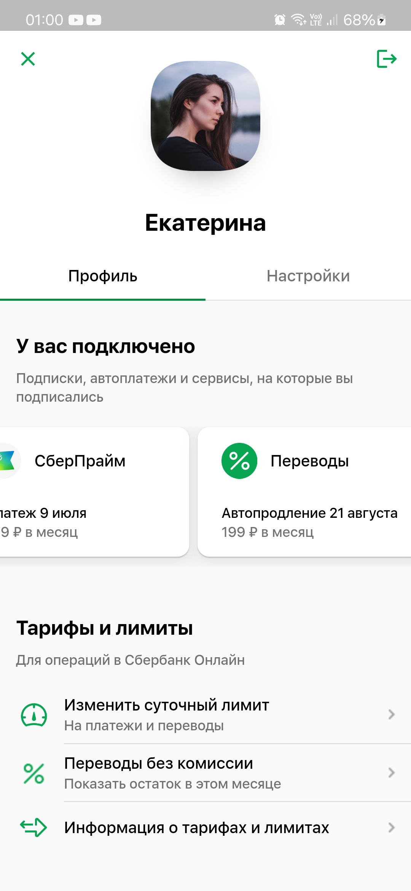
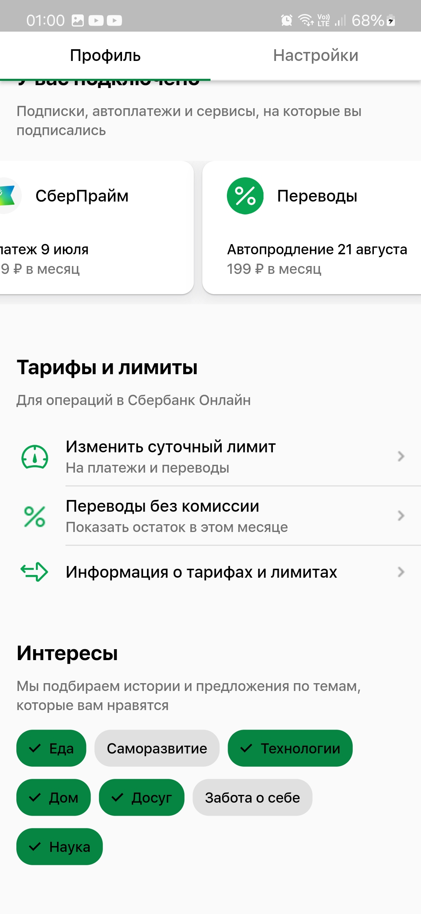
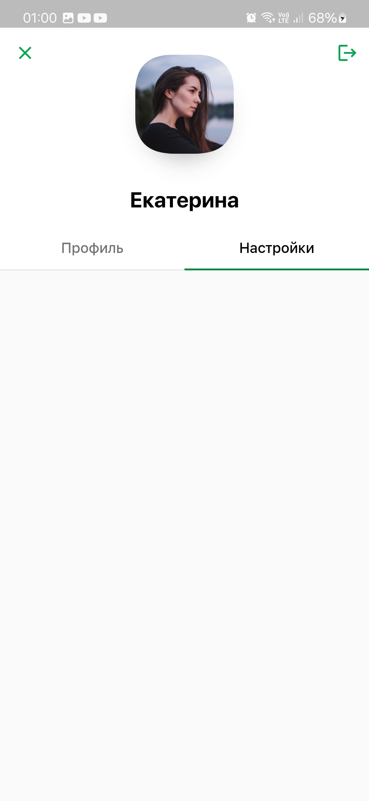

# «Профессиональная разработка мобильных приложений»

## Лабораторная работа №3: реализация экрана при помощи фреймворка Flutter (Flutter-разработка)

## Задание

Необходимо реализовать экран приложения Сбербанка при помощи фреймворка **Flutter**.

## Описание приложения

**Версия фреймворка Flutter: > 3.2.3.**

Глобально, экран состоит из следующих частей:

1. заголовок экрана (аппбар):
    - кнопки выхода из приложения и из аккаунта;
    - фотография пользователя;
    - имя пользователя;
2. таббар, состоящий из двух элементов: профиль и настройки (далее речт идет исключительно о табе с профилем);
3. текущие подключения (оформлено в виде горизонтального списка подключенных сервисов);
4. тарифы и лимиты (список пунктов меню);
5. интересы (представлен в виде чипов с текстом).

## Результат работы

В результате работы был **реализован экран**, состоящий из всех компонентов. Также был **создан репозиторий**, 
в котором хранится история версий экрана (присутствует **ветвление**). Был **оформлен файл README.md**, 
хранящий информацию о лабораторной работе, **приложены скриншоты работы**. **Настроен .gitignore**, 
чтобы в проекте не было лишних файлов.

Конфигурация стилей приложения осуществляется через **объект с темами**, у элементов, которые этого требуют, **присутствует hover-эффект**, при выборе таба с настройками **появляется пустой экран**.

## Демонстрация экрана

    
    
    

